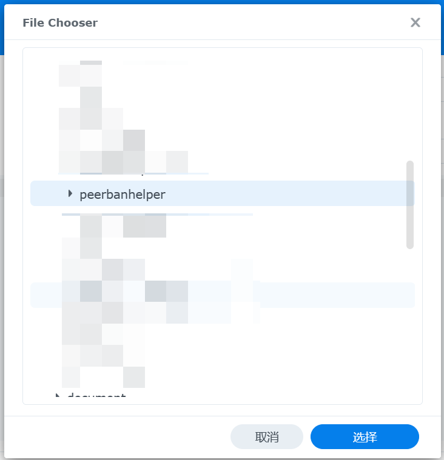
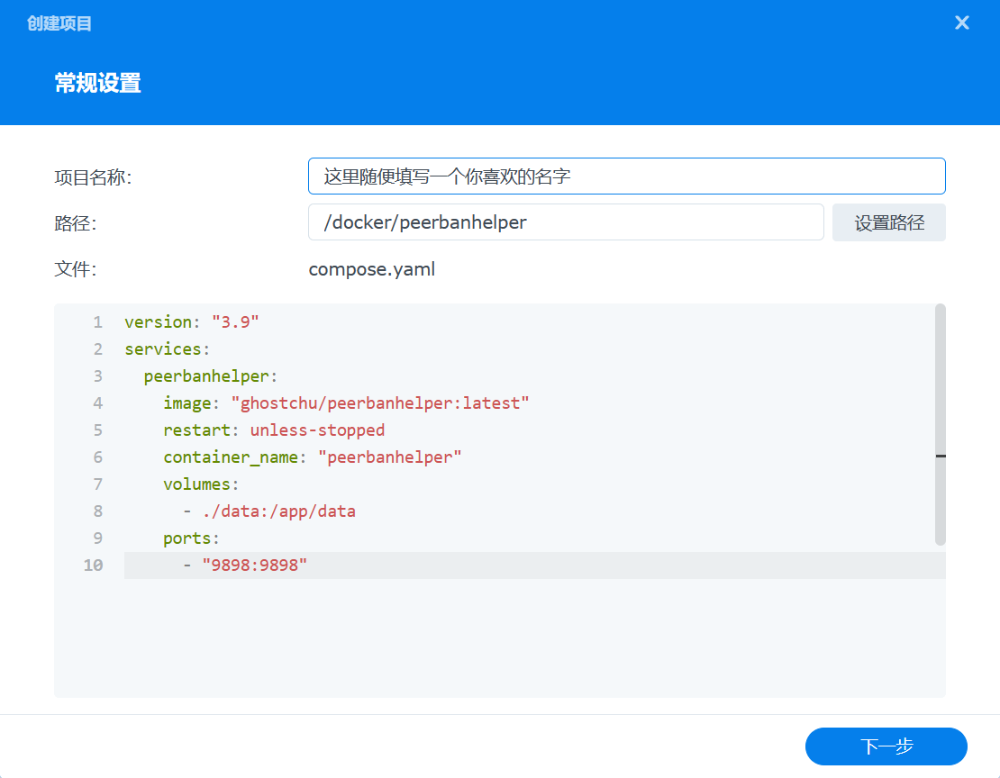
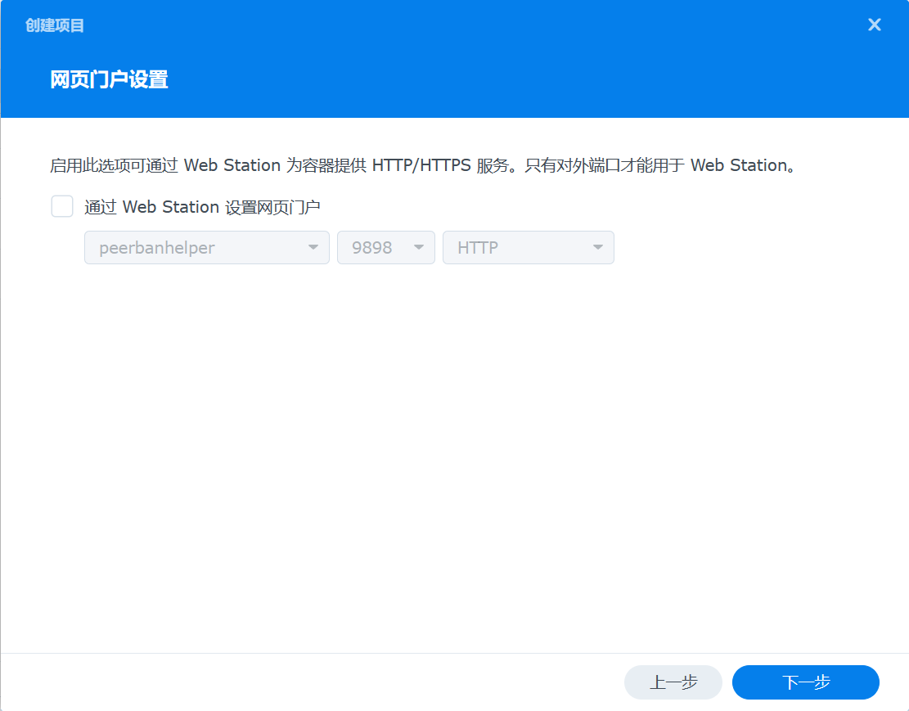
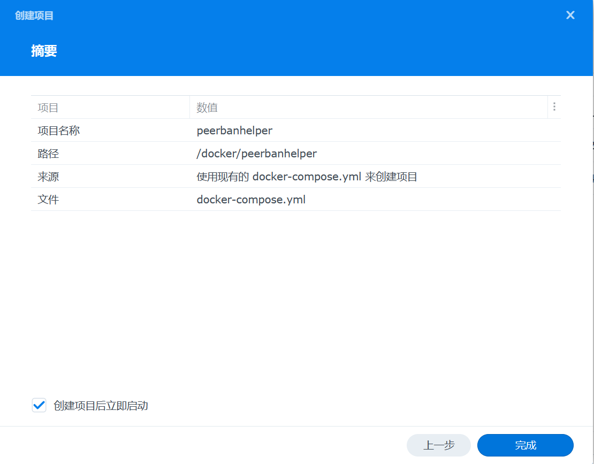
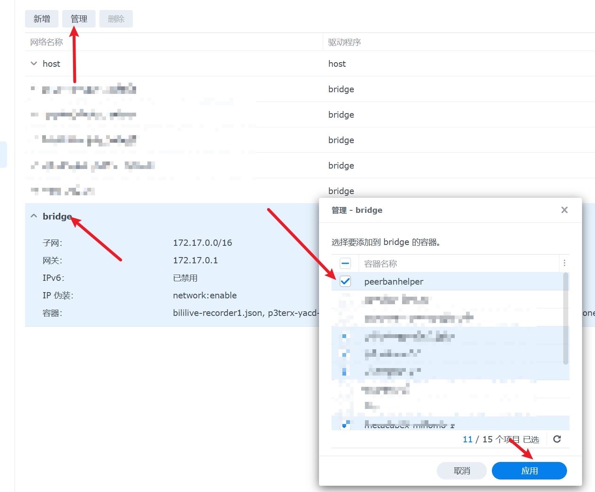

# Synology DSM 群晖

## 创建数据目录

首先，为 PBH 创建文件夹，用于存放 PBH 的配置文件。


在 Container Manager 中，选择项目，点击新增按钮，来源选择 “创建 docker-compose.yml”（请务必先选择来源，否则后续操作将覆盖已设置的内容）。


随后，点击 `设置路径` 按钮，配置 Docker Compose 的位置到我们刚刚创建的好的文件夹：




## 获取版本标签

首先访问 [PBH最新版版本发布页](https://github.com/PBH-BTN/PeerBanHelper/releases/latest)，向下滚动，找到如图所示的 “Docker 用户” 章节，并复制镜像标签备用。  


**不要拉取 latest 镜像，你可能会得到一个远古/开发版本，出问题将无法获得支持。**  

```yaml
version: "3.9"
services:
  peerbanhelper:
    image: "镜像标签""
    restart: unless-stopped
    container_name: "peerbanhelper"
    volumes:
      - ./:/app/data
    ports:
      - "9898:9898"
    environment:
      - PUID=0
      - PGID=0
      - TZ=UTC
```

然后粘贴到编辑框中（图中仅为示例参考）



如果询问你是否设置网页门户，请**不要启用**：



一路下一步，启动容器。首次启动完成后，配置文件应该会自动生成，配置好配置文件后再次重启 Docker 容器即可使用。



## 如果无法连接下载器

### 原因1：使用了 127.0.0.1

参见：[常见问题](../faq.md#127001-或者-localhost-连不上下载器)

### 原因2：PBH 容器未自动加入 Bridge 网络组

此情况仅在少部分设备上出现，部分设备可能需要手动加入 bridge 网络组：


